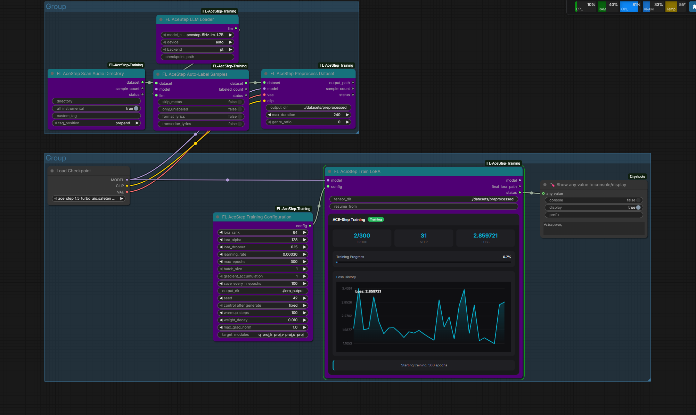

# FL AceStep Training

LoRA training nodes for ComfyUI powered by [ACE-Step 1.5](https://github.com/ace-step/ACE-Step-1.5), the open-source music generation foundation model. Train custom LoRAs to personalize music generation with your own style, voice, or genre — entirely within ComfyUI's node graph.

[](https://github.com/ace-step/ACE-Step-1.5)
[](https://github.com/comfyanonymous/ComfyUI)
[](https://www.patreon.com/Machinedelusions)



## Features

- **End-to-End Training** — Full LoRA training pipeline inside ComfyUI's node graph
- **Dataset Management** — Scan audio directories, auto-label with LLM, load sidecar metadata
- **Tiled VAE Encoding** — Handles long audio via 30-second chunks with 2-second overlap
- **Real-Time Training UI** — Live loss chart, progress bar, and stats via WebSocket widget
- **Auto Model Download** — LLM models download automatically from HuggingFace on first use
- **Native ComfyUI Types** — Uses MODEL, VAE, and CLIP from ComfyUI's built-in checkpoint loader

## Nodes

| Node | Category | Description |
|------|----------|-------------|
| **FL AceStep LLM Loader** | Loaders | Load 5Hz causal LM (0.6B / 1.7B / 4B) for auto-labeling |
| **FL AceStep Scan Audio Directory** | Dataset | Recursively scan folders for audio files with sidecar metadata |
| **FL AceStep Auto-Label Samples** | Dataset | Generate captions, BPM, key, genre, and lyrics via LLM |
| **FL AceStep Preprocess Dataset** | Dataset | VAE-encode audio and CLIP-encode text, save as `.pt` tensors |
| **FL AceStep Training Configuration** | Training | Configure LoRA rank/alpha/dropout and training hyperparameters |
| **FL AceStep Train LoRA** | Training | Run flow matching training loop with real-time progress widget |

## Installation

### Manual
```bash
cd ComfyUI/custom_nodes
git clone https://github.com/filliptm/ComfyUI-FL-AceStep-Training.git
cd ComfyUI-FL-AceStep-Training
pip install -r requirements.txt
```

### Frontend (optional rebuild)
```bash
npm install
npm run build
```

The pre-built JS is included in `js/`, so rebuilding is only needed if modifying the training widget UI.

## Quick Start

### Training Pipeline

1. **Load Checkpoint** — Use ComfyUI's native `Load Checkpoint` node with an ACE-Step model to get **MODEL**, **VAE**, and **CLIP**
2. **Load LLM** *(optional)* — Add `FL AceStep LLM Loader` if you want auto-labeling
3. **Scan Dataset** — Use `FL AceStep Scan Audio Directory` to find your audio files
4. **Label** — Connect **MODEL**, **VAE**, and **LLM** to `FL AceStep Auto-Label Samples` for LLM-generated metadata
5. **Preprocess** — Run `FL AceStep Preprocess Dataset` with **MODEL**, **VAE**, and **CLIP** to encode audio/text to tensors
6. **Configure** — Set LoRA rank, learning rate, epochs in `FL AceStep Training Configuration`
7. **Train** — Connect **MODEL** and **config** to `FL AceStep Train LoRA` and execute

### Using Trained LoRAs

Use ComfyUI's native LoRA loading nodes to apply your trained LoRA for inference with the built-in ACE-Step nodes.

## Node Details

### FL AceStep LLM Loader

Loads one of three 5Hz causal language models for auto-labeling audio samples.

| Input | Type | Default | Notes |
|-------|------|---------|-------|
| model_name | Dropdown | `acestep-5Hz-lm-1.7B` | Also: `0.6B`, `4B` |
| device | Dropdown | `auto` | `auto` / `cuda` / `cpu` |
| backend | Dropdown | `pt` | `pt` / `vllm` |
| checkpoint_path | STRING | *(empty)* | Optional, leave empty for auto-download |

**Output:** `ACESTEP_LLM`

### FL AceStep Scan Audio Directory

Recursively scans a directory for audio files and loads accompanying metadata.

| Input | Type | Default | Notes |
|-------|------|---------|-------|
| directory | STRING | — | Path to audio folder |
| all_instrumental | BOOLEAN | `True` | Mark all samples as instrumental |
| custom_tag | STRING | *(empty)* | LoRA activation tag (e.g., `my_style`) |
| tag_position | Dropdown | `prepend` | `prepend` / `append` / `replace` |

**Outputs:** `ACESTEP_DATASET`, sample count, status

### FL AceStep Auto-Label Samples

Uses the loaded LLM to generate metadata for each audio sample.

| Input | Type | Default | Notes |
|-------|------|---------|-------|
| dataset | ACESTEP_DATASET | — | From Scan Directory |
| model | MODEL | — | ACE-Step model (purple) |
| vae | VAE | — | ACE-Step VAE (red) — used for audio-to-codes |
| llm | ACESTEP_LLM | — | From LLM Loader |
| skip_metas | BOOLEAN | `False` | Skip BPM/key/time signature |
| only_unlabeled | BOOLEAN | `False` | Process only unlabeled samples |
| format_lyrics | BOOLEAN | `False` | Format user-provided lyrics with LLM |
| transcribe_lyrics | BOOLEAN | `False` | Transcribe lyrics from audio |

**Outputs:** `ACESTEP_DATASET`, labeled count, status

### FL AceStep Preprocess Dataset

VAE-encodes audio and CLIP-encodes text to `.pt` tensor files for training.

| Input | Type | Default | Notes |
|-------|------|---------|-------|
| dataset | ACESTEP_DATASET | — | From label or scan node |
| model | MODEL | — | ACE-Step model (purple) |
| vae | VAE | — | ACE-Step VAE (red) |
| clip | CLIP | — | ACE-Step CLIP (yellow) |
| output_dir | STRING | `./output/acestep/datasets` | — |
| max_duration | FLOAT | `240.0` | 10–600 seconds |
| genre_ratio | INT | `0` | 0–100% chance to use genre instead of caption |

**Outputs:** output path, sample count, status

### FL AceStep Training Configuration

| Parameter | Default | Range |
|-----------|---------|-------|
| LoRA Rank | 8 | 4–256 (step 4) |
| LoRA Alpha | 16 | 4–512 (step 4) |
| LoRA Dropout | 0.1 | 0–0.5 |
| Learning Rate | 1e-4 | 1e-6 – 1e-2 |
| Max Epochs | 100 | 10–10000 |
| Batch Size | 1 | 1–8 |
| Gradient Accumulation | 4 | 1–16 |
| Save Every N Epochs | 10 | 5–1000 |
| Seed | 42 | — |
| **Optional** | | |
| Warmup Steps | 100 | 0–1000 |
| Weight Decay | 0.01 | 0–0.1 |
| Max Grad Norm | 1.0 | 0.1–10.0 |
| Target Modules | `q_proj,k_proj,v_proj,o_proj` | Comma-separated |

**Output:** `ACESTEP_TRAINING_CONFIG`

Mixed precision is fixed to **bf16**. The turbo model uses **8-step discrete timesteps** with shift=3.0.

### FL AceStep Train LoRA

Runs the training loop with flow matching loss: `MSE(predicted_v, x1 - x0)`.

| Input | Type | Default | Notes |
|-------|------|---------|-------|
| model | MODEL | — | ACE-Step model (purple) |
| config | ACESTEP_TRAINING_CONFIG | — | From config node |
| tensor_dir | STRING | `./output/acestep/datasets` | Directory of `.pt` files |
| lora_name | STRING | `my_lora` | Name for the trained LoRA (used as subfolder) |
| resume_from | STRING | *(empty)* | Path to checkpoint to resume from |

**Outputs:** MODEL (with LoRA), final LoRA path, status

The training widget displays a live loss chart, progress bar, and per-epoch stats via WebSocket (`acestep.training.progress`).

## Supported Audio Formats

`.wav`, `.mp3`, `.flac`, `.ogg`, `.opus`, `.m4a`

Sidecar files for metadata:
- `.txt` files alongside audio for lyrics
- `key_bpm.csv` or `metadata.csv` for BPM, key, and caption data

## Requirements

- Python 3.10+
- NVIDIA GPU with 8GB+ VRAM (bf16 training)
- PyTorch 2.0+
- PEFT (Parameter-Efficient Fine-Tuning)
- Transformers, Diffusers, Accelerate

## License

MIT
